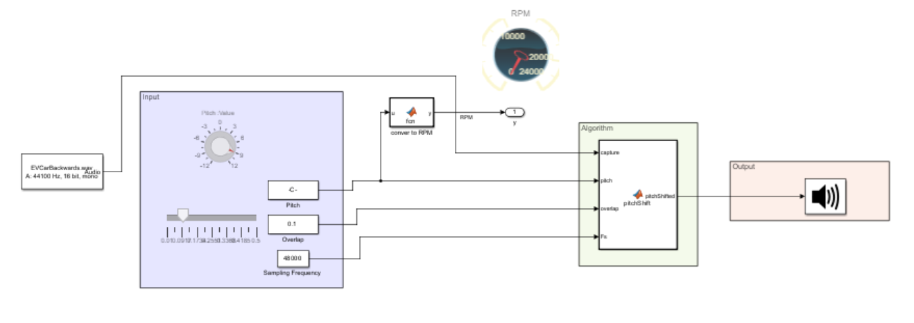

# simulating EV sound -- Generating the sound of an electric vehicle with variable speed in Simulink®

## Overview
This Simulink model simulates the sound of an electric vehicle moving at different speed. The user can adjust a knob to simulate the sound of a vehicle running at different RPM. The algorithm is very simple and can be implemented in any processors. The code uses Audio Plugins in Simulink (https://www.mathworks.com/help/audio/ug/audio-plugin-example-gallery.html).

## How to get started
open the file changeEVsoundBackwards.slx and click Run

## Relevant Industries
audio plugin, automobile manufacturing, EV research, auto industry, audio equipment, audio systems design, sound effects development

## Relevant Products
 *  MATLAB®
 *  Simulink® 
 *  Audio Toolbox™

Copyright 2025 The MathWorks, Inc.
